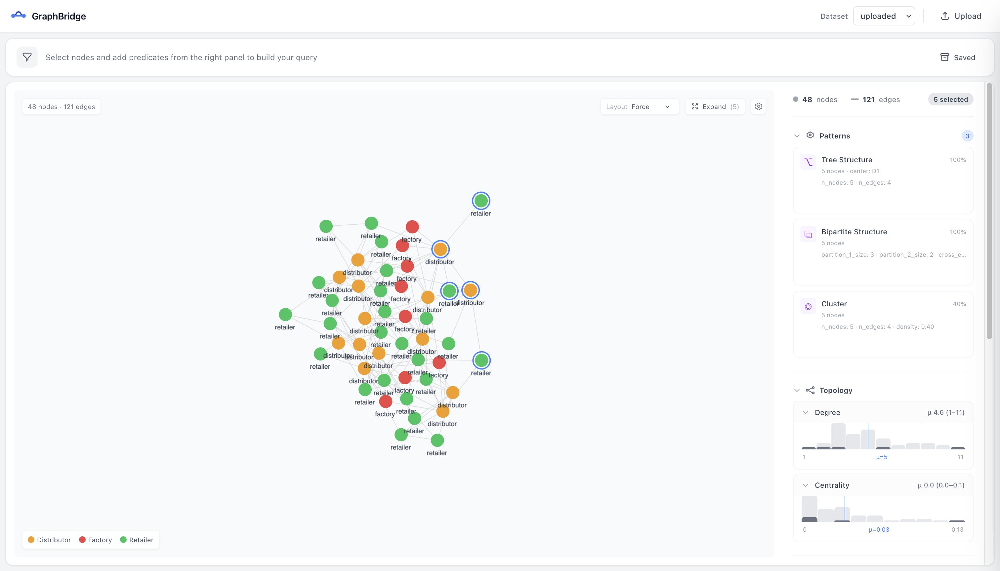

# GraphBridge

Visual graph analysis for NetworkX. Load graphs, explore interactively, detect structural patterns.



## Setup

```bash
# Start the server
docker compose up -d

# Install the Python client
pip install graphbridge
```

## Usage

```python
import networkx as nx
from graphbridge import GraphBridge

gb = GraphBridge()
gb.load(nx.karate_club_graph(), default_node_label="Person")
gb.open()

patterns = gb.get_patterns()
```

## License

MIT
