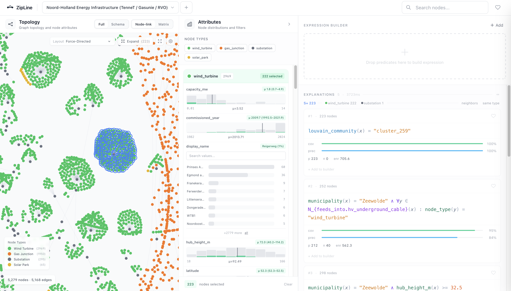

# ZipLine

**Find and describe patterns in graph data**

[](https://github.com/sjoerdvink99/zipline/actions/workflows/docker.yml)
[](https://github.com/sjoerdvink99/zipline/pkgs/container/zipline)
[](LICENSE)



ZipLine is a web app for exploring graphs where nodes have properties. Select a group of nodes, and ZipLine generates a rule that describes what they have in common. Rules can reference node properties and graph structure such as degree, community membership, or the properties of neighboring nodes. You can edit rules, use them as filters, and refine your selection until you have articulated the pattern you were looking for.

## Quick Start

**Docker:**

```bash
docker run -p 8000:8000 ghcr.io/sjoerdvink99/zipline
```

Open [http://localhost:8000](http://localhost:8000).

**From source:**

```bash
git clone https://github.com/sjoerdvink99/zipline
cd zipline
make setup    # Install dependencies
make data     # Fetch sample datasets
make dev      # Start backend (:8000) and frontend (:5173)
```

## How It Works

1. Load a graph. Each node can have any number of properties.
2. Select a group of nodes by clicking, lassoing, or brushing over property values.
3. ZipLine generates a rule describing what those nodes have in common:
   ```
   type = "apt_group"  AND  degree >= 8  AND  has_neighbor where type = "technique"
   ```
4. Edit the rule in the visual builder, apply it as a filter, or change your selection and re-explain.

## Features

|                          |                                                                                                                |
| ------------------------ | -------------------------------------------------------------------------------------------------------------- |
| **Rule learning**        | Automatically generates rules from a node selection using beam search over graph structure and node properties |
| **Neighbor conditions**  | Rules can express conditions on a node's neighbors, such as "has at least 2 neighbors where type = X"          |
| **Visual rule builder**  | Build and edit rules with a drag-and-drop interface, no query syntax required                                  |
| **Live filtering**       | Apply any rule as a filter and immediately see which nodes match                                               |
| **Contrastive learning** | Learn what distinguishes one group of nodes from another                                                       |

## Datasets

Three graphs are included out of the box:

| Dataset   | Domain                | Nodes | Edges  | Source                 |
| --------- | --------------------- | ----- | ------ | ---------------------- |
| BRON      | Cybersecurity         | 1,743 | 19,215 | MITRE ATT&CK           |
| PrimeKG   | Drug repurposing      | 2,106 | 96,628 | Harvard PrimeKG        |
| TenneT NH | Energy infrastructure | 5,280 | 5,220  | TenneT / Gasunie / RVO |

You can also upload your own graph through the UI or connect a Neo4j database.

## Architecture

```
┌─────────────────────────────────────────────────────────────────┐
│  Frontend: React 19 · TypeScript · PIXI.js · D3.js · Zustand   │
├──────────────────────┬──────────────────────┬───────────────────┤
│   Graph view         │  Rule builder        │  Attribute view   │
└──────────┬───────────┴──────────┬───────────┴───────────────────┘
           │         REST API          │
┌──────────┴───────────────────────────┴──────────────────────────┐
│  Backend: Python 3.10+ · FastAPI · NetworkX · Pydantic          │
├─────────────────────────────────────────────────────────────────┤
│  Rule engine: parser · evaluator · beam search · inference      │
└─────────────────────────────────────────────────────────────────┘
```

## Development

```bash
make dev-backend    # Backend only (port 8000)
make dev-frontend   # Frontend only (port 5173)
make test           # Run test suite (249 tests)
make lint           # Code quality checks
make docker         # Build Docker image
```

## Project Structure

```
ZipLine/
├── backend/
│   └── src/
│       ├── app.py                  # FastAPI application
│       ├── api/                    # REST endpoints
│       ├── fol/                    # Rule engine (parser, evaluator, inference)
│       │   └── learning/           # Rule learning (beam search, scoring)
│       ├── models/                 # Pydantic schemas
│       ├── services/               # Business logic
│       └── core/                   # Dataset management
│   └── tests/                      # 249 tests
├── frontend/
│   └── src/
│       ├── components/             # UI components
│       ├── api/                    # API client
│       ├── store/                  # Zustand state
│       ├── hooks/                  # React hooks
│       ├── types/                  # TypeScript types
│       └── utils/                  # Helpers
├── data/                           # Sample datasets
├── docs/                           # Documentation
└── scripts/                        # Data scripts
```

## Citation

If you use ZipLine in your research, please cite:

```bibtex
@inproceedings{vink2025zipline,
  title     = {ZipLine: Visual Analysis of Multivariate Graphs with Predicate Logic},
  author    = {Sjoerd Vink and Suyang Li and Brian Montambault and Michael Behrisch and Mingwei Li and Remco Chang},
  year      = {2025},
}
```

## License

MIT
